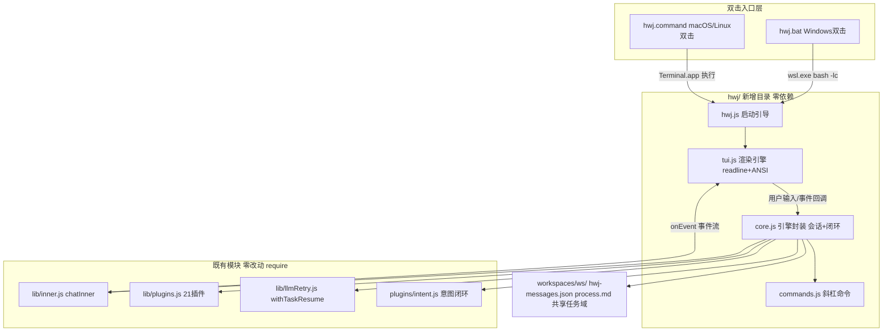

# hwj 终端智能体 技术设计

Feature Name: hwj-terminal-agent
Updated: 2026-08-22

## Description

hwj 是 dual-agent 内层 Agent 能力的终端封装：零依赖 Node TUI（对标 opencode 形态），Windows 双击 `hwj.bat` 经 WSL 直达交互界面。进程内直接 require `lib/inner.js` + `lib/plugins.js`（零改动复用），会话独立落盘，配置与网页版共享，纯增量新增 `hwj/` 目录与启动脚本。

## Architecture



要点：

- hwj 与 server 是并行前端：同一内核（chatInner + 插件），两种交互面（Web SSE / TUI ANSI）
- 会话独立（hwj-messages.json），任务域共享（memory/todo/skills/uploads/process.md 同目录同插件读写）
- 配置共享：读写同一 `.data/config.json` 的 `inner` 段

## Components and Interfaces

### hwj.bat（Windows 双击 → WSL 启动链）

```bat
@echo off
chcp 65001 >nul
rem 安装路径：默认推断，可用环境变量 HWJ_HOME 覆盖
```

探测流程（每步失败均打印中文指引 + `pause` 保留窗口）：

1. `where wsl` — WSL 存在性；缺失 → 指引「启用 WSL：wsl --install」
2. 路径解析：优先 `%HWJ_HOME%`（WSL 侧绝对路径）；否则用 `wsl.exe wslpath -a "<bat所在Windows路径>"` 把双击位置映射为 WSL 路径（bat 随仓库分发时天然正确）；再兜底常见路径探测（`~/dual-agent`、`/workspace/dual-agent`，逐个 `wsl.exe test -f`）
3. `wsl.exe -e bash -lc "command -v node && node -v"` — Node 存在性与 ≥18 校验；缺失 → 指引 NodeSource 安装命令
4. 启动：`wsl.exe -e bash -lc "cd '<path>' && exec node hwj/hwj.js"`（`exec` 让 node 接管进程，Ctrl+C 直达）
5. hwj 退出后 `pause` 防窗口闪退；exit code 透传

`hwj.command`（macOS/Linux）：`#!/bin/bash` + `cd "$(dirname "$0")"` + node 探测 + `exec node hwj/hwj.js`，`chmod +x` 后双击由系统终端执行。

### hwj/hwj.js（入口引导）

```
main():
  1. TTY 检测：process.stdout.isTTY 为 false 时打印诊断（需在终端运行）退出码 2
  2. 环境解析：--ws <name> 指定工作区（默认 default），--script <msg> 进入非交互批处理模式（e2e 用）
  3. 配置检测：读 .data/config.json 的 inner 段；缺失 → 首次进入 /config 向导
  4. 加载会话：workspaces/<ws>/hwj-messages.json 存在则恢复并打印「已恢复会话（N 条消息）」
  5. 启动 TUI 主循环
```

### hwj/tui.js（渲染引擎）

**分区模型**（自上而下）：

```
┌──────────────── 终端窗口 ────────────────┐
│ 消息流区（append-only，打印后不重绘）      │
│  你  创建 hello.txt                       │
│  hwj 好的，开始执行（流式重绘区）           │
│   ⠋ bash  pwd                            │
│   ✓ bash  120ms                          │
│   ⠋ write hello.txt                      │
│  [框架提示] 检测到多步任务…（弱化行）       │
├──────────────────────────────────────────┤
│ 状态栏（单行，随事件刷新）                  │
│ hwj v0.9.28 · build · ws:default · 12.3k tok · 轮 3/24 │
├──────────────────────────────────────────┤
│ 输入区（readline 独占最后行）              │
│ > _                                     │
└──────────────────────────────────────────┘
```

**渲染原语**（全部 process.stdout.write ANSI）：

- `clearLine()` = `\x1b[2K\x1b[1G`；上移 n 行重写 = `\x1b[{n}F` + 逐行 clearLine
- 颜色：用户行青 `\x1b[36m`、助手行绿 `\x1b[32m`、工具行灰 `\x1b[90m`、info 弱化暗黄 `\x1b[33m\x1b[2m`、错误红 `\x1b[31m`；每行尾 `\x1b[0m` 复位
- spinner：125ms setInterval 轮换 `⠋⠙⠹⠸⠼⠴⠦⠧⠇⠏`

**活动区机制**（核心）：当前任务轮的「流式回复 + pending 工具行」属于活动区，保存在内存行数组；每次事件（text/tool_call/tool_result/spinner tick）触发 `redrawActive()`：上移活动区行数 → 逐行清行重写 → 光标回到输入区 prompt。任务 done 后活动区整体「沉降」为消息流（append-only，此后不再动）。

**text 快照语义**：chatInner 的 text 事件是每轮快照覆盖（`pendingText = ev.text`），TUI 维护 `replyBuf`，收到 text 时整段替换并重绘，实现流式打字效果。

**输入区并发**：readline prompt 持续可用；任务运行中输入的消息进入本地队列（上限 5，对齐 server 语义），当前任务完成后自动依次提交；prompt 前缀在运行中显示 `queued> `。

**中断协议**：readline `SIGINT` 事件 → 运行中：置 `state.abort = true`（chatInner 每轮工具调用前检查，抛出 `HwjAbortError` 优雅终止，已完成轮次已由 onRound 落盘）；空闲：打印「再按一次 Ctrl+C 退出」，3 秒窗口内第二次 SIGINT → 持久化会话 → 恢复终端状态（显示光标、释放 raw mode）→ 退出码 0。

**导出接口**（供测试的纯函数与 UI 对象分离）：

```js
module.exports = {
  createTui,                 // (opts) => tui 对象（依附 TTY）
  renderToolLine,            // (call, result?, width) => string 纯函数
  renderStatusBar,           // (state, width) => string 纯函数
  wrapText,                  // (text, width) => string[] 纯函数（CJK 双宽感知）
  ellipsis,                  // (s, max) => string 纯函数
};
```

CJK 宽度计算：字符码点 > 0x2E80 按 2 列宽（覆盖 CJK 统一表意、全角标点），换行/截断按显示宽度对齐。

### hwj/core.js（引擎封装）

职责：复刻 server.js 中 handleInnerChat 的任务编排（server 为单体无法 require，此文件为终端版等价实现），接口对齐 `lib/inner.js` 既有导出。

```js
// 对外主接口
async function runTask(input, ctx) // input: 用户消息; ctx: { ws, mode, ui, abortSignal }
// 返回 { ok, finalText } ；内部完成：注入 → 执行 → 闭环核验 → 落盘
```

`runTask` 编排序列（与 server.js:445-822 handleInnerChat 语义对齐）：

1. **会话装配**：`messages` 载入 hwj-messages.json；system 首位重建（`buildHwjSystemPrompt()`：日期注入 + 终端场景版纪律——与 server 版差异仅「交付说明面向终端阅读」措辞）
2. **意图抽取**：`runPlugin('intent', { action:'extract', task: input })`（server.js:524 同款）
3. **finalMsg 注入**：`isMultiStepTask` → todo+verify 纪律；`isLongFormTask` → 分章创作纪律 + 能力账本；`isRefusalNudge` → 对齐指令（三函数直接 require lib/inner.js）
4. **执行循环**：`withTaskResume(() => chatInner(cfg, messages, toolDefs(), callPluginWrapped, handleEvent, { todoNote, shouldContinue, intentNote, onRound: persist, readonly: mode==='plan', abortCheck }), { onInfo })`
   - `callPluginWrapped`：写探针（write/edit/bash 重定向置位 wroteAny）+ 里程碑记忆（todo toggle → memory.save）
   - `abortCheck()`：TUI 中断标志轮询，true 时抛 HwjAbortError
5. **长文零写入强制重入**（上限 2 次）与 **wall-clock 超时注入**（默认 30 分钟，`DUAL_AGENT_TASK_TIMEOUT_MS` 覆盖）
6. **交付核验闭环**：`intent.deliverables` 硬断言（exists/json_valid）→ judge（`runPlugin('intent',{action:'verify'})`）→ gaps 注入返修重入（上限 2 轮）——复刻 server.js:748-807
7. **落盘**：messages 经 `pairSafeTail(messages, 60)` 裁剪后写 hwj-messages.json；事件同步追加 process.md（同 server 格式：任务头/💬 内层/🔧 工具/⏳ 提示）

**plan 模式拦截**：`opts.readonly = true` 传入 chatInner（lib/inner.js 已内建 READONLY_PLUGINS 子级硬拦截，主循环层 core.js 对写类插件返回「plan 模式已拦截：X 插件为写操作，/mode build 解锁」）。

**会话/配置持久化**：

```js
const SESSION = path.join(WS_DIR, 'hwj-messages.json'); // 独立会话（R5）
const CONFIG  = path.join(DATA_DIR, 'config.json');     // 共享配置（R4，同 server 格式）
const STATE   = path.join(DATA_DIR, 'hwj-state.json');  // { mode, ws, profile } hwj 私有
```

### hwj/commands.js（斜杠命令）

| 命令 | 行为 |
|---|---|
| /help | 命令清单 + 一句话说明 |
| /config | 三项向导（base_url/api_key/model），回车保留旧值，写回 config.json |
| /mode build\|plan | 切换模式，状态栏即时反映 |
| /model | 显示当前配置与 profiles 轮转清单；/model <n> 切换 |
| /workspace <name> / /workspace | 切换/列出工作区（NAME_RE 校验，切时保存并重载会话） |
| /reset | 确认后清空 hwj-messages.json + intent clear + 重建 system |
| /history | 会话条数摘要 + 最近 N 条预览 |
| /usage | 读 inner-usage.json 聚合（调 usage 插件 history） |
| /memory / /todo | 透传 memory.search / todo.list 插件结果 |
| /export <file.md> | 会话导出 Markdown 到工作区 |
| /clear | 清屏（\x1b[2J\x1b[H）保留会话 |
| /exit | 持久化后退出 |

命令路由：输入以 `/` 开头 → commands 分发；否则 → core.runTask。

## Data Models

```js
// hwj-messages.json（与 server 消息结构同构，独立文件）
[{ role: 'system'|'user'|'assistant'|'tool', content, tool_calls?, tool_call_id? }]

// hwj-state.json
{ "mode": "build"|"plan", "ws": "default", "profile": null }

// config.json（复用既有，不改结构）
{ "inner": { "base_url": "...", "api_key": "...", "model": "...", "profiles": [...] } }

// TUI 活动区内存模型
state = {
  replyBuf: '',            // 当前轮流式回复（text 快照）
  toolRows: [{ plugin, args, t0, done, ok, ms }],  // pending/完成工具行
  queue: [],               // 运行中排队的用户消息（≤5）
  abort: false,            // SIGINT 置位
  tokens: { prompt: 0, completion: 0, calls: 0 },  // usage 累计（状态栏）
}
```

## Correctness Properties

1. **增量性不变量**：`git diff --stat` 中 server.js / lib/*.js / plugins/*.js / public/ 零变更；hwj 仅 require 既有导出，新增文件不修改任何既有文件
2. **会话配对完整性**：任意时刻落盘的 hwj-messages.json 满足「每条 role:tool 存在前置 assistant.tool_calls 宿主」（pairSafeTail 保证），重启后 API 调用不 400
3. **中断安全**：SIGINT 只终止未开始的轮次；已完成轮次的 tool_calls + tool 结果均已 onRound 落盘；abort 后会话可继续（下一条消息正常续跑）
4. **零依赖**：hwj/*.js 仅 require Node 内置模块 + 仓库内既有 lib/plugins；`node --check` 通过且无 node_modules
5. **配置写回兼容**：/config 向导写回的 config.json 保持 server 可读（同 schema），server 运行中不并发写（向导仅在 hwj 侧空闲时进入）
6. **双端任务域一致性**：hwj 与 server 对同一工作区的 memory/todo/uploads 读写走同一插件 ctx（cwd=WS_DIR），无额外路径映射

## Error Handling

| 场景 | 处理 |
|---|---|
| WSL/Node 缺失 | hwj.bat 中文指引（含安装命令）+ pause，exit 1 |
| 非 TTY 启动 | 打印「请在终端中运行」诊断，exit 2 |
| 配置缺失/无效 | 首启自动进入 /config 向导；保存后重试连接 |
| API 网络错误 | withTaskResume 退避重入（30s/60s/120s）；info 行提示进度；耗尽后错误行展示 + 会话保留 |
| 任务超时 | 30 分钟注入收敛指令（同 server P15），不硬杀 |
| Ctrl+C 中断 | HwjAbortError 捕获 → 「已中断（保留 N 轮记录）」→ 输入态 |
| 会话文件损坏 | JSON.parse 失败 → 备份为 .bak → 空会话重开 + 警告行 |
| 终端 resize | SIGWINCH → 状态栏/工具行按新宽度重排（活动区重绘，消息流不回溯） |
| Ctrl+Z 挂起 | 不处理（默认 SIGTSTP 行为），恢复后 redrawActive 自愈 |

## Test Strategy

`test/hwj-smoke.js`（独立于既有 test/smoke.js，不动后者）：

1. **语法段**：`node --check hwj/*.js` + 启动脚本 bat/command 静态断言（含 wslpath 探测分支关键字符串）
2. **单元段**（纯函数，非 TTY 可跑）：
   - wrapText：CJK 双宽对齐、超长截断、空串
   - renderToolLine / renderStatusBar：宽度自适应、状态图标、token 格式化
   - ellipsis：边界
   - 会话持久化：写入→恢复→损坏文件降级
   - 命令路由：已知命令分发、未知命令提示 /help
3. **e2e 段**（`DUAL_AGENT_MOCK=1` + 隔离 DATA/WS 环境变量，复用既有测试隔离模式）：
   - `node hwj/hwj.js --script "创建文件 demo.txt"` 批处理模式：断言 stdout 含工具行（bash/write）、最终交付文本、退出码 0
   - 批处理模式下 hwj-messages.json 落盘且配对完整（遍历校验 tool 宿主）
   - plan 模式批处理：写插件被拦截提示出现在输出
   - /export 生成 Markdown 文件且含会话内容
4. **回归护栏**：既有 `node test/smoke.js` 全量通过（证明零改动未被破坏）

## References

- 需求文档：`.monkeycode/specs/2026-08-22-hwj-terminal-agent/requirements.md`
- 内层引擎接口：dual-agent/lib/inner.js#L530（chatInner 签名）、#L536（导出清单）
- 任务编排参照：dual-agent/server.js#L445-L822（handleInnerChat 全序列）
- 交付核验闭环参照：dual-agent/server.js#L748-L807
- 意图插件：dual-agent/plugins/intent.js#L300（params）、getState/getIntentNote 模块导出
- 重试重入：dual-agent/lib/llmRetry.js#L79（withTaskResume）
- opencode 形态参照：https://github.com/anomalyco/opencode（TUI、build/plan 双 agent、命令系统）
- 测试隔离模式：dual-agent/test/smoke.js 既有 e2e 环境变量约定

## 实施计划（任务拆解）

| # | 任务 | 产出 | 验证 |
|---|---|---|---|
| 1 | tui.js 纯函数层 | wrapText/renderToolLine/renderStatusBar/ellipsis | 单测（CJK/宽度/截断） |
| 2 | core.js 持久化层 | 会话/配置/状态读写 + 损坏降级 | 单测（恢复/备份） |
| 3 | core.js 引擎编排 | runTask（注入/执行/闭环/落盘/中断） | MOCK 批处理 e2e |
| 4 | hwj.js 入口 + TUI 主循环 | createTui/活动区/SIGINT 协议 | TTY 手测 + --script e2e |
| 5 | commands.js | 12 个斜杠命令 + 向导 | 命令路由单测 + 手测 |
| 6 | hwj.bat / hwj.command | 双击启动链（探测/指引/exec） | bat 静态断言 + WSL 手测 |
| 7 | test/hwj-smoke.js | 三段式冒烟 | 全绿 |
| 8 | 回归 + 发布 | test/smoke.js 全过 → v0.9.28 tag + release | gh release |
